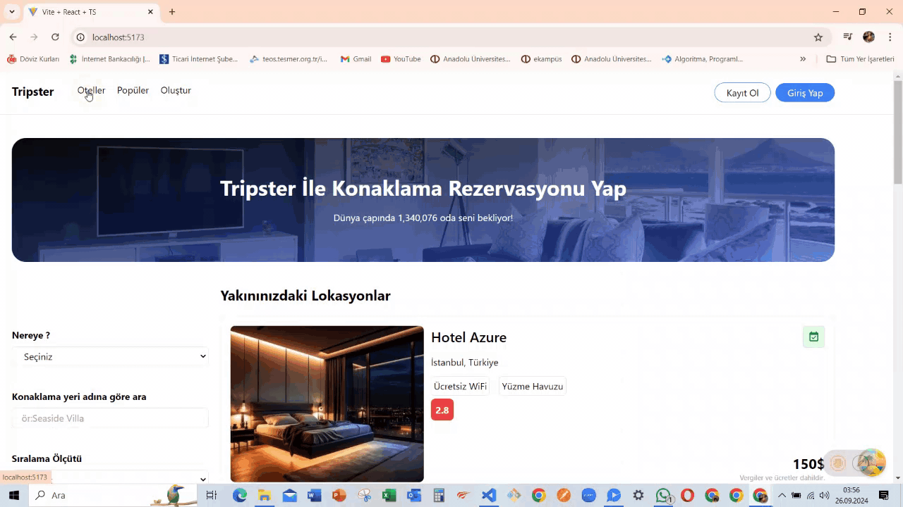

# Hotels App

Hotels App, kullanıcıların yakınlarındaki konaklama noktalarını bulmalarını ve listelemelerini sağlayan bir web uygulamasıdır  

# Özellikler

- Yakınınızdaki konaklama noktalarını listeleyin
- Yeni konaklama noktaları ekleyin
- Kullanıcı dostu arayüz

# Tanstack Query

- Eski adıyla react-query kütüphanesi, react uygulamalarında api'dan alınan verileri verimli ve kolay bir şekilde yönetmek için kullanılan yaygın bir kütüphanedir. Veri alımı, eri Yönetimi, Önbellekleme(Caching) işlemlerini yapar.  

# Temel Kavramları

1. Query (Sorgu): Sayfa yüklendiği anda verileri almak için kullandığımız yöntem.(get)  

2. Mutation: Sayfa yüklendiği anda eğil istediğimi zaman (butona tıklama) api isteği atmak için kullanılır.(get, post, put,delete)  

3. Cache (Önbellek):React Query, alınan verileri otomatik olarak önbelleğe alır ve gerektiğinde önbellekteki verileri kullanarak performansı atrtırır  

4. Devtools (Geliştirici Araçları): Racet query kullandığımız uygulamalardaki sorguları ve mutation'ları izleme ve yönetmemizi sağlayan eklenti.  

5. Invalidate: Mevcut sorgunun tekrar çağrılmasıyla olayı.  

#Kurulum
-npm i @tanstack/react-query
-main.jsx'de provider'ı tanıt

# Kütüphanler

- JavaScript / React
- Typescript
- @tanstack/react-query
- @tanstack/react-query-devtools
- axios
- react-toastify
- react-router-dom
- react-icons
- tailwind

